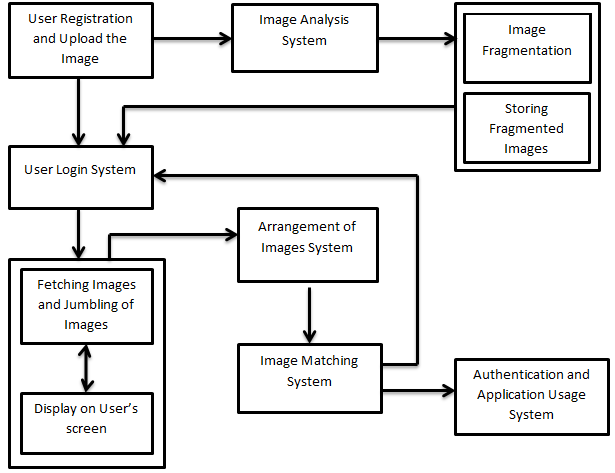
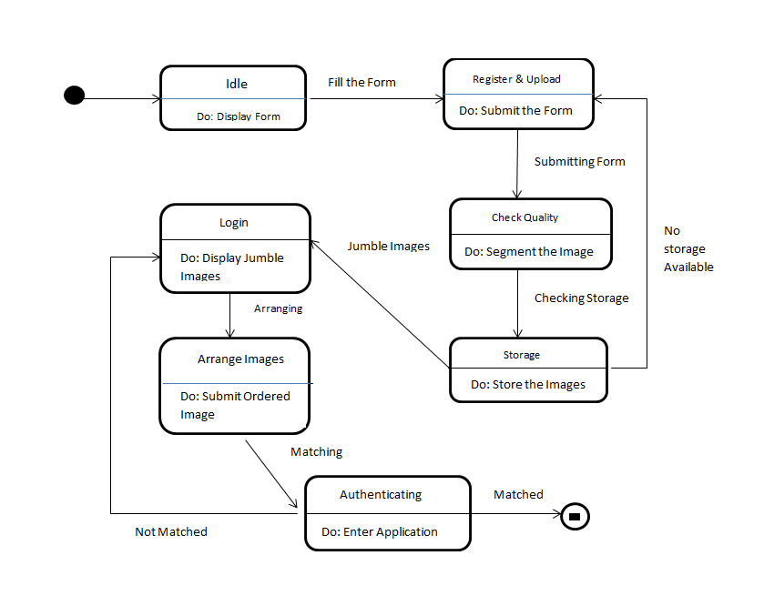

# Graphical Password using Image Segmentation
The project allows user to input an image as an alternative to a textual password, the system segments the image into an array of images and stores them accordingly. The next time user logs on to the system the segmented image is presented by the system in a jumbled order. In order to login successfully, the user has to arrange the jumbled images.

## Architecture Diagram

## State Transition Diagram

## Modules Description
* __Image Submission Module__: This module collects data from the user along with an image to be used as a password and store it in the database.
* __Image Fragmentation Module__: This module selects a suitable algorithm for image fragmentation, applies the algorithm on it and prepares them for storage.
* __Image Fragments Storage Module__: This module checks for contiguous spaces in the memory and store the fragments in it.
* __Images Jumbling Module__: This module jumbles the images row-wise and displays them on the users screen so that he/she can arrange the images in correct order.
* __Authentication Module__: This module matches the arranged image with the original image and authenticates the user if they matches otherwise asks the user to try again.